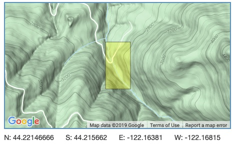
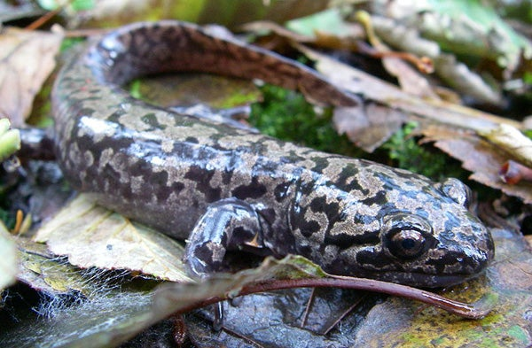

```{r setup, include=FALSE}
knitr::opts_chunk$set(echo = FALSE, message = FALSE, warning = FALSE)
# -------------------------
# Attach necessary packages
# -------------------------
library(tidyverse)
library(janitor)
library(directlabels)
library(kableExtra)
library(ggrepel)
library(plotly)
library(gridExtra)
library(grid)
library(effsize)
library(car)

```

```{r}
# -----------------
# Read in csv file
# -----------------

salamander_df <- read_csv("mack_creek_vertebrates.csv") %>%
# Read in lobster_abundance_sbc_lter,csv
# and assign it to an object. 
# Pipe to move to the next step.
  clean_names() %>% 
# Simplify names to contain only _, character, 
# numbers, and letters.
# Pipe to move to the next step.
  filter(species %in% c("DITE"))
# Use filter so we only see salamander data.

```

### Introduction


The pacific giant salamanders (*dicamptodon tenebrosus*) are a native species and the largest amphibians known in Oregon. Observing these species can give a clear signal on whether their water habitat is healthy as they are sensitive to water quality and are the first animals to react to negative impacts on their aquatic environment.

Since 1987 to present day, the Andrews Forest Long Term Ecological Research (Andrews Forest LTER) has been observing pacific giant salamanders as part of an aquatic vertebrate population study. The overall purpose of the study has been to observe the impacts of land use on the aquatic vertebrates. The research team conducted their work in Mack Creek located in the Andrews Experimental Forest in Oregon. The research team has been focusing on two specific areas of the creek; an upstream 500 year old coniferous forest and a clearcut forest.

Andrews Forest Long Term Ecological Reasearch has been using 2-pass electrofishing to capture specimen from the two regions of Mack Creek and measure and weigh each one for their records.


Figure 1. Andrews Forest Long Term Ecological Research



Credit: [EDI Data Portal](https://portal.edirepository.org/nis/mapbrowse?scope=knb-lter-and&identifier=4027&revision=12)


Figure 2. Pacific Giant Salamander



Credit: [Jeffrey Marsten Wikimedia](https://commons.wikimedia.org/wiki/File:Dicamptodon_tenebrosus_2.JPG)


### Data and Methods

Data for this project was collected from 1987 to present day by the Andrews Forest Long Term Ecological Research team. Salamander counts, measurements, and weights were annually collected at two 150 meter sections (clear cut and old growth) of Mack Creek. The two 150 meter sections were partinioned off in three 50 meter reaches by nets. Each 50 meter reach was then sampled with 2-pass electrofishing. Salamander trends in clear cut areas of Mack Creek were compared with salamander trends in old growth areas of Mack Creek. All data was analyzed and put into figures through the software R version 3.6.1.

### Results

##### 1. Observed annual salamander counts in old growth and clear cut sections of Mack Creek

In the two creek areas, annual salamander counts followed a similar trend. However, there is no significant difference in salamander counts between the two sections of Mack Creek observed from 1993 to 2017.

```{r}
# --------------------
# Create Graph A data
# --------------------

salamander_count <- salamander_df %>% 
# Call the data and assign it to an object.
# Pipe to move to the next step.
  group_by(section, year) %>% 
# Group receiving section and year by collapsing 
# multiple data points into a single row,
# based on what is summarized in the next step.
# Pipe to move to the next step.
  select(section, year, entity) %>% 
# Select specific columns to keep in the data frame.
  summarize("total" = sum(entity)) %>% 
# Summarize (new column = whatever you're doing(metric)).
    mutate("section_name" = ifelse(section == "OG", "old growth",
                              ifelse(section == "CC", "clear cut")))
# Create a new column containing non-abbreviated section names.
  
```

```{r, fig.cap="Figure 3: Annual salamander counts observed from 1993 - 2017 in two sections of Mack Creek that were either old growth (dark green) or clear cut (light green) in the Andrews Experimental Forest. Data: Andrews Forest LTER"}
# ---------------
# Create Graph A
# ---------------

ggplot(data = salamander_count, aes(x = year, y = total, group = section)) + 
# Create a graph and call out data to be used,
# including what the x and y variables are.
# To create individual lines by section, need group = section.
  geom_line(aes(color = section_name), size = 1.2) +
# Color lines by section and specify line size.
  labs(color = "Sections of Mack Creek",
       x = "Year",
       y = "Annual salamander counts") + 
# Use color to create the legend title and create 
# labels for the x and y axes and title.
  theme_light() +
# Call out a theme to tweak the display of an existing theme.
  geom_dl(aes(label = section_name), 
          method = list(dl.combine("last.points"), 
                        cex = .8)) + 
# Use geom_dl for direct labels on the lines, cex is font size, 
# method needs to be written like this.
  theme(legend.position = c(0.19, 0.837)) + 
# Manually reposition legend.
  scale_x_continuous(expand = c(0,0),
                     limits = c(1993,2025)) + 
# Needed to expand limits for years.
  scale_y_continuous(expand = c(0,0),
                     limits = c(0, 550)) +
# Needed to expand limits for section counts.
  scale_color_manual(breaks = c("old growth", "clear cut"), 
                     values = c("darkseagreen3", "darkslategray")) 
# Manually change line colors in graph based on 
# whether a section is old growth or clear cut.

```


##### 2. Table of 2017 salamander counts by channel classification (pool, cascades and side-channel) in old growth (OG) and clear cut (CC) sections of Mack Creek.

Figure 4. Numbers of salamanders observed in cascades, pools and side-channels in clear cut and old growth forest sections along Mack Creek. Percentages are relative to the area of the creek. 
```{r}
# -------------------------------
# Create data and results B table 
# -------------------------------

channel_class_df <- salamander_df %>% 
  filter(section %in% c("CC", "OG")) %>% 
# Filter data for only Clear Cut and Old Growth.
  filter(unittype %in% c("C", "SC", "P")) %>%
# Filter for only pools, side channels and channel.
  filter(year %in% c(2017)) %>% 
  # Filter for only 2017
  mutate("creek_area" = ifelse(unittype == "C", "Cascade",
                        ifelse(unittype == "SC", "Side-Channel", "Pool"))) %>%
# Make names nicer for table.
  count(section, creek_area)
# Count the data for salamanders in these variables.

channel_class_table <- channel_class_df %>% 
  pivot_wider(names_from = section,
              values_from = n) 

channel_class_table_props <- channel_class_table %>%
# Pivot wider to make a contingency table, long format bad for this
  adorn_percentages(denominator = "row") %>% 
# Denominator = row to get pct on row.
  adorn_pct_formatting(digits = 1) %>% 
# Rounding the decimal places.
  adorn_ns(position = "front")
# Numbers in front of percentages.

channel_class_table_props %>% 
  kable(col.names = c("Area of Creek",
                      "Clear Cut", 
                      "Old Growth")) %>% 
# Column names - can't change row names in kable.
  kable_styling(bootstrap_options = "striped",
                full_width = F,
                position = "center") %>% 
# Full width (F), centered table.
  add_header_above(bold = TRUE,
                   line = TRUE, 
                   c("Salamanders Observed in Mack Creek" = 3))
# Header number has to match number of columns.

```


```{r}
# ------------
# Results C
# chi-squared
# ------------

# Using the 2017 counts found in Results B above, answer: is there a significant difference in where in the channel Pacific giant salamanders are located (pool, cascade or side channel) between the two sections (old growth and clear cut)?

# Is there an association between where PGS live in the channel and what type of forest it is?

# H0: There is no association in where in the channel PGS are located b/w the two sections (CC vs. OG)
# HA: There is an association in where in the channel PGS are located b/w the two sections (CC vs. OG)
# Chi-squared test 

channel_class_table_chi <- channel_class_table %>% 
  select(-creek_area)
# Create data for chi sq. test.

channel_class_chi <- chisq.test(channel_class_table_chi)
# Create chi sq. test.

p_val_chi <- ifelse(channel_class_chi$p.value < .001, "< 0.001" , channel_class_chi$p.value)

# Use ifelse to show p values lower than .001.

```

Based on these results, there is no observed association between where salamanders are found depending on whether or not they are in a clear cut or old growth section of Mack Creek (p = `r round(p_val_chi, 2)`).


##### 3. Compared weights of Pacific giant salamanders in clear cut and old growth forest sections of Mack creek in 2017.

```{r}
# --------------------
# Create Graph D data
# --------------------

salamander_weight <- salamander_df %>%  
#Call out data and assign it to an object.
#Pipe to move to the next step.
  filter(year %in% c("2017")) %>%
# Filter out the observations during the year 2017.
  group_by(section, year) %>%
# Group receiving section and year by collapsing
# multiple data points into a single row.
# Pipe to move to the next step.
  select(year, section, weight) %>%
# Select specific columns to keep in the data frame.
  mutate("section_name" = ifelse(section == "OG", "old growth",
                              ifelse(section == "CC", "clear cut")))
#Create a new column containing non-abbreviated section names.

salamander_weight_av <- salamander_weight %>% 
#Call out data and assign it to an object.
#Pipe to move to the next step.
  group_by(section, year) %>%
# Group receiving section and year by collapsing
# multiple data points into a single row.
# Pipe to move to the next step.
  summarize(weight_av = mean(weight, na.rm = TRUE)) %>% 
# Summarize (new column = whatever you're doing(metric)).
  filter(year %in% c(2017))
# Filter out the observations during the year 2017.

```

```{r message=FALSE, warning=FALSE, include=FALSE, paged.print=FALSE}
# ----------------------
# Visually explore data
# ----------------------

# Faceted histogram: 
ggplot(data = salamander_weight, aes(x = weight)) +
  geom_histogram(aes(fill = section_name),
# Create a graph and call out data to be used,
# including what the x variable is.
                 alpha = 0.5,
# Edit transparency.
                 show.legend = FALSE,
# Remove legend.
                 bins = 15) +
  facet_wrap(~section_name, scales = "free")
# Compare graphs side by side.


# Faceted QQ plots: 
ggplot(data = salamander_weight, aes(sample = weight)) +
  geom_qq(aes(color = section_name),
# Create a graph and call out data to be used,
# including what the x variable is.
                 alpha = 0.5,
# Edit transparency.          
                 show.legend = FALSE) +
# Remove legend.
  facet_wrap(~section_name, scales = "free")
# Compare graphs side by side.

# Means are not normally distributed, they are positively skewed, but because of central tendency theorem and our large sample size, we can still compare means.


```


```{r, fig.cap="Figure 5: Salamander weight in old growth and clear cut areas in Mack Creek in 2017 and kernal density for mean salamandar weight in old growth areas (dark green) and in clear cut areas (light green) in 2017. The means are shown as dashed lines. Data: Andrews Forest LTER"}
# ---------------
# Create Graph D 
# ---------------

ggplot(data = salamander_weight, aes(x = weight,
# Create a graph and call out data to be used,
# including what the x variable is.
                                    fill = as.character(section),
                                    color = as.character(section))) +
# Using as.character allows me to group them by year.
  geom_density(alpha = 0.3) +
  scale_fill_manual(breaks = c("old growth", 
                               "clear cut"), 
                    values = c("darkslategray", 
                               "darkseagreen3")) +
# Specify colors for the fill of the curves.
  scale_color_manual(breaks = c("old growth", 
                                "clear cut"), 
                     values = c("darkslategray", 
                                "darkseagreen3")) +
# Specify colors for the lines.
  theme_minimal() +
# Call out a theme to tweak the display of an existing theme.
  theme(legend.position = "none") +  
# Don't want a legend, label manually.
  annotate(
     geom = "curve",
# Use geom="curve" for curved line, geom="segment" for straight.
     x = 4,
# Line start.
    y = 0.101,
# Line start.
     xend = 14,
# Line end.
     yend = 0.1125,
# Line end.
     curvature = .2,
# Level of curve.
     color = "darkseagreen3") +
# Values entered manually for where I want lines to begin and end.
   annotate(geom = "text",
            x = 14.55,
# Where my text will be.
            y = .113,
# Where my text will be.
           label = "Clear cut",
           hjust = "left",
           color = "darkseagreen3") +
# Annotation for 2018.
   annotate(
     geom = "curve",
# Use geom="curve" for curved line, geom="segment" for straight.
     x = 12.5,
# Start of line.
     y = 0.03,
# Start of line.
     xend = 25,
# End of line.
     yend = 0.045,
# End of line.
    curvature = .2,
# Level of curve.
     color = "darkslategray") +
# Values entered manually for where I want the lines to begin and end.
   annotate(geom = "text",
            x = 26,
# Where my label will sit.
            y = 0.045,
# Where my label will sit.
            label = "Old growth",
            hjust = "left",
color = "darkslategray") +
# Annotation for 2012.
   geom_vline(xintercept = 6.583333,
              color = "darkslategray",
              linetype = "dashed",
              size = 0.5) +
   geom_vline(xintercept = 7.775870,
              color = "darkseagreen3",
             linetype = "dashed",
              size = 0.5) +
# Means taken from lobster_size_av dataframe.
# Using vline allows me to draw a vertical line of the mean.
  labs(x = "Salamander weight (grams)",
       y = "Kernel density")
# Create labels for the x and y axes and title.
# Create caption below the graph and edit font size and style.


```

```{r}
# -------------------
# ttest for this data
# -------------------

# Need to filter data to new df's.

og_salamander <- salamander_weight %>% 
  filter(section %in% c("OG"))

cc_salamander <- salamander_weight %>% 
  filter(section %in% c("CC"))

# Conduct ttests for salamander weights in old growth and clear cut areas.
og_cc_ttest <- t.test(og_salamander$weight, 
                      cc_salamander$weight, 
                      na.rm = TRUE)

og_cc_cd <- effsize::cohen.d(og_salamander$weight, 
                             cc_salamander$weight,
                             na.rm = TRUE)

# Find standard deviations.

sd_og <- sd(og_salamander$weight, na.rm = TRUE)
sd_cc <- sd(cc_salamander$weight, na.rm = TRUE)

salamander_2017 <- salamander_count %>% 
  filter(year %in% c(2017))
# Find sample size.

sample_og_cc <- sum(salamander_2017$total, na.rm = TRUE)

# Find means.

mean_og <- mean(og_salamander$weight, na.rm = TRUE)
mean_cc <- mean(cc_salamander$weight, na.rm = TRUE)

```

For salamanders observed in the two types of forest in Mack Creek (n = `r sample_og_cc`), for old growth sections the mean weight of salamanders is `r round(mean_og, 2)` $\pm$ `r round(sd_og, 2)` and for clear cut sections the mean weight of salamanders is `r round(mean_cc, 2)` $\pm$ `r round(sd_cc, 2)` with an actual difference in mean size between the two years being `r round(mean_og - mean_cc, 2)` (two-sided t-test, t(`r round(og_cc_ttest$parameter, 2)`) = `r round(og_cc_ttest$statistic, 2)`, p = `r round(og_cc_ttest$p.value, 2)`) with an effect size of `r round(og_cc_cd$estimate, 2)`. This indicates that there is no significant difference in weights of Salamanders observed between the two types of forest.

##### 4. Compared weights of Pacific giant salamanders in pools, cascades and side-channels of Mack Creek in 2017.

```{r}
# --------------------------
# Filter data for results E
# --------------------------

creek_area_weight <- salamander_df %>%  
  #Call out data and assign it to an object.
  #Pipe to move to the next step.
  filter(year %in% c("2017")) %>%
  # Filter out the observations during the year 2017.
  filter(unittype %in% c("C", "P", "SC")) %>% 
  # want only channel pool and side-channel
  group_by(unittype, year) %>%
  # Group receiving section and year by collapsing
  # multiple data points into a single row.
  # Pipe to move to the next step.
  select(year, unittype, weight) %>%
  # Select specific columns to keep in the data frame.
  mutate("creek_area" = ifelse(unittype == "C", "Cascade",
                                 ifelse(unittype == "P", "Pool", "Side-Channel")))
# Compare weights of Pacific giant salamanders in pools, cascades and side-channels of Mack Creek in 2017.

creek_area_summary <- creek_area_weight %>% 
  #Call out data and assign it to an object.
  #Pipe to move to the next step.
  group_by(unittype, year) %>%
  # Group receiving section and year by collapsing
  # multiple data points into a single row.
  # Pipe to move to the next step.
  summarize(weight_av = mean(weight, na.rm = TRUE),
            weight_sd = sd(weight, na.rm = TRUE),
            sample_size = n(),
            weight_se = sd(weight, na.rm = TRUE) / sqrt(n())) %>% 
  # Summarize (new column = whatever you're doing(metric)).
  filter(year %in% c(2017)) %>% 
  mutate("creek_area" = ifelse(unittype == "C", "Cascade",
                               ifelse(unittype == "P", "Pool", "Side-Channel")))
# Filter out the observations during the year 2017.

```

```{r, include=FALSE}
# -----------------------------------
# Visually explore the means of data
# -----------------------------------

# Faceted histogram: 
ggplot(data = creek_area_weight, aes(x = weight)) +
  geom_histogram() +
# Create a graph and call out data to be used,
# including what the x variable is.
  facet_wrap(~creek_area)
# Compare graphs side by side.

ggplot(data = creek_area_weight, aes(sample = weight)) +
  geom_qq() +
# Create a graph and call out data to be used,
# including what the x variable is.
  facet_wrap(~creek_area)
# Compare graphs side by side.


# Samples are not normally distributed but we can assume that because of central limit theorem that the means of samples will be.
```

```{r, fig.cap="Figure 6: Salamander weights observed in pool (sky blue), cascade (turquoise), and side-channel (cornflower blue) areas in the overall two sections (old growth and clear cut) of Mack Creek in 2017. Mean salamandar weights are highlighted as the black points of the graph with the brackets extending to the standard errors of the mean. Data: Andrews Forest LTER"}

# ---------------
# Create Graph E
# ---------------

ggplot() +
  geom_jitter(data = creek_area_weight, 
              aes(x = creek_area, 
                  y = weight,
# Create a graph and call out data to be used,
# including what the x and y variables are.
                  color = creek_area),
# Color jitterplot by creek area.
              alpha = 0.5) +
# Adjust transparency.
  scale_color_manual(breaks = c("Cascade", 
                                "Pool",
                                "Side-Channel"), 
                     values = c("darkturquoise", 
                                "deepskyblue3",
                                "cornflowerblue")) +
# Specify colors for the points.
  theme_minimal() +
# Call out a theme to tweak the display of an existing theme.
  theme(legend.position = "none") +
  geom_point(data = creek_area_summary,
           aes(x = creek_area,
               y = weight_av),
           color = "black",
           size = 2) +
  labs(x = "Creek area",
       y = "Weight (grams)") +
# Add salamander weight average points and adjust color and size.
  geom_errorbar(data = creek_area_summary,
                aes(x = creek_area,
                    ymin = weight_av - weight_av, 
# minus weight_av because weight can't be below zero.
                    ymax = weight_av + weight_sd),
                width = 0.15, 
                color = "black") 
# Error bar width and color adjustment.

```

```{r, include=FALSE}
# -----------------------------------
# Statistical Analysis for results E
# -----------------------------------

# Need to test for equal variance because ANOVA only works if group variance in the largest # is only 4x greater than the smallest.

# ---------
# levene's test
# ---------

# H0: Group variances are equal
# HA: Group variances are not equal

#Salamander_var <- leveneTest(weight ~ creek_area, data = creek_area_weight).

# Retain null - variances are equal, can do ANOVA.

# --------
# ANOVA
# --------

salamander_aov <- aov(weight ~ creek_area, data = creek_area_weight)

salamander_aov_summary <- unlist(summary(salamander_aov))

# p = 0.007, there is a significant difference between at least 2 of the creek areas.
# Uae tukey's HSD for post-hoc.

# --------
# Tukey's HSD for post hoc
# --------


salamander_post_hoc <- TukeyHSD(salamander_aov)
salamander_post_hoc

# Side-channel and cascade (p = 0.05), side-channel and pool (p = 0.01) have signifcant differences, pool and channel don't (p=0.28).

# -------
# Cohen's D for effect size
# -------

sc_weight <- creek_area_weight %>% 
  filter(unittype %in% c("SC"))

c_weight <- creek_area_weight %>% 
  filter(unittype %in% c("C"))

p_weight <- creek_area_weight %>% 
  filter(unittype %in% c("P"))

cd_sc_c <- effsize::cohen.d(sc_weight$weight, c_weight$weight, na.rm = TRUE)

cd_sc_p <- effsize::cohen.d(p_weight$weight, sc_weight$weight, na.rm = TRUE)

# ---------
# Summary statsitics
# ---------

# filter data frames

c_salamander <- creek_area_weight %>% 
  filter(unittype %in% c("C"))

p_salamander <- creek_area_weight %>% 
  filter(unittype %in% c("P"))

sc_salamander <- creek_area_weight %>% 
  filter(unittype %in% c("SC"))

#standard deviation

sd_c <- sd(c_salamander$weight, na.rm = TRUE)
sd_p <- sd(p_salamander$weight, na.rm = TRUE)
sd_sc <- sd(sc_salamander$weight, na.rm = TRUE)


#mean

mean_c <- mean(c_salamander$weight, na.rm = TRUE)
mean_p <- mean(p_salamander$weight, na.rm = TRUE)
mean_sc <- mean(sc_salamander$weight, na.rm = TRUE)


```

In Mack Creek (n = `r sample_og_cc`), the mean weight for salamanders found in cascades was `r round(mean_c, 2)` $\pm$ `r round(sd_c, 2)`, in pools the mean weight of salamanders was `r round(mean_p, 2)` $\pm$ `r round(sd_p, 2)`, and for side-channels the mean weight of salamanders was `r round(mean_sc, 2)` $\pm$ `r round(sd_sc, 2)` (one-way ANOVA, `r salamander_aov_summary[2]`) = `r round(salamander_aov_summary[7], 2)`, p-value = `r round(salamander_aov_summary[9], 3)`).
Using Tukey’s HSD, the post hoc pairwise testing shows that the mean weights of salamanders in pools differ significantly from salamanders in side-channels(p-value = `r round(salamander_post_hoc$creek_area[12], 3)`). The significant difference in mean weight between salamanders is only seen between salamanders in pools and side-channels. Despite the significant difference, the effect size is relatively small (`r round(cd_sc_p$estimate, 2)`).  Between salamanders in pools and cascades, there is no observed significant difference in means (p-value = `r round(salamander_post_hoc$creek_area[10], 3)`). Similarly, there is no observed significant difference for salamanders in side-channels and in cascades: (p-value = `r round(salamander_post_hoc$creek_area[11], 3)`).


#### Summary

- There is no significant difference in salamander counts between the two overall sections of Mack Creek (old growth and clear cut) from 1993 to 2017 (Figure 3).
- There is no association between salamander counts and the two sections of Mack Creek and their three sub-region areas (cascade, pool, and side-channel) in 2017 (Figure 4).
- There is no association and not a significant difference in salamander weights overall in old growth and clear cut areas of Mack Creek in 2017 (Figure 5).
- There is an association between salamander weight and the specific areas of the two sections of Mack Creek. There is a significant difference in salamander weight in cascade, pool, and side-channel areas between old growth and clear cut sections in 2017 (Figure 6).


#### References

**Gregory S. V. 2016.** Aquatic Vertebrate Population Study in Mack Creek, Andrews Experimental Forest, 1987 to present. Environmental Data Initiative. https://doi.org/10.6073/pasta/5de64af9c11579266ef20da2ff32f702. Dataset accessed 11/19/2019.

**“Andrews Forest Data Web Site.”** Andrews Forest, andlter.forestry.oregonstate.edu/data/abstractdetail.aspx?dbcode=AS006.

**“Pacific Giant Salamander: Oregon Wild.”** Pacific Giant Salamander | Oregon Wild, oregonwild.org/wildlife/pacific-giant-salamander.
